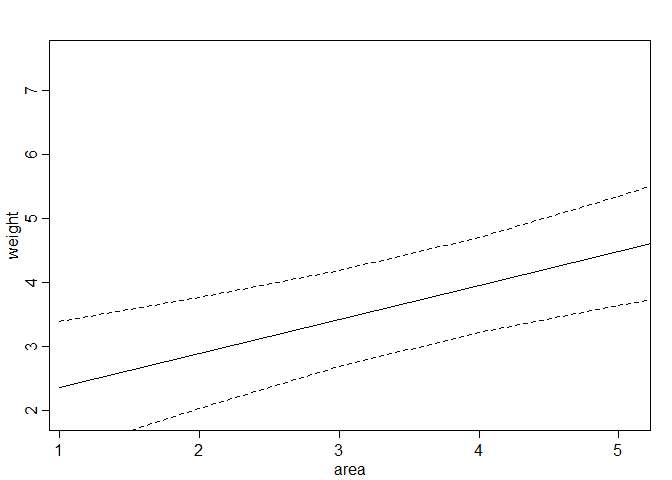

# Chapter-05-part2-assignment
# Statistical Rethinking Chapter 4 problems

__Name:__


# For 04/18/2016

## 5M2
Masked relationship: outcome pos corr var 1, neg corr var 2, var 1 corr var 2.
Habitat quality and predator density on prey fitness.
**
## 5H1


```r
library(rethinking)
```

```
## Loading required package: rstan
```

```
## Loading required package: ggplot2
```

```
## rstan (Version 2.9.0-3, packaged: 2016-02-11 15:54:41 UTC, GitRev: 05c3d0058b6a)
```

```
## For execution on a local, multicore CPU with excess RAM we recommend calling
## rstan_options(auto_write = TRUE)
## options(mc.cores = parallel::detectCores())
```

```
## Loading required package: parallel
```

```
## rethinking (Version 1.58)
```

```r
data(foxes)

#first standardize the variables
foxes$area.s <- (foxes$area - mean(foxes$area))/sd(foxes$area)
foxes$groupsize.s <- (foxes$groupsize - mean(foxes$groupsize))/sd(foxes$groupsize)

m5H1.a <- map(
alist(
weight ~ dnorm( mu , sigma ) ,
mu <- a + bA * area.s ,
a ~ dnorm( 10 , 10 ) ,
bA ~ dnorm( 0 , 1 ) ,
sigma ~ dunif( 0 , 10 )
) , data = foxes )

m5H1.b <- map(
alist(
weight ~ dnorm( mu , sigma ) ,
mu <- a + bA * groupsize.s ,
a ~ dnorm( 10 , 10 ) ,
bA ~ dnorm( 0 , 1 ) ,
sigma ~ dunif( 0 , 10 )
) , data = foxes )

# plot it all

MAM.seq.a <- seq( from=-3 , to=3, length.out=30 )
mu.a <- link( m5H1.a , data=data.frame(area.s=MAM.seq.a) )
```

```
## [ 100 / 1000 ]
[ 200 / 1000 ]
[ 300 / 1000 ]
[ 400 / 1000 ]
[ 500 / 1000 ]
[ 600 / 1000 ]
[ 700 / 1000 ]
[ 800 / 1000 ]
[ 900 / 1000 ]
[ 1000 / 1000 ]
```

```r
mu.PI.a <- apply( mu.a , 2 , PI )
plot( weight ~ area.s , data=foxes , col=rangi2 )
abline( m5H1.a )
```

```
## Warning in abline(m5H1.a): only using the first two of 3 regression
## coefficients
```

```r
shade(mu.PI.a, MAM.seq.a)
```


```r
MAM.seq.b <- seq ( from =-3, to=3, length.out=30)
mu.b <- link(m5H1.b, data=data.frame(groupsize.s=MAM.seq.b))
```

```
## [ 100 / 1000 ]
[ 200 / 1000 ]
[ 300 / 1000 ]
[ 400 / 1000 ]
[ 500 / 1000 ]
[ 600 / 1000 ]
[ 700 / 1000 ]
[ 800 / 1000 ]
[ 900 / 1000 ]
[ 1000 / 1000 ]
```

```r
mu.PI.b <- apply(mu.b, 2, PI)
plot( weight ~ groupsize.s , data=foxes , col=rangi2 )
abline( m5H1.b )
```

```
## Warning in abline(m5H1.b): only using the first two of 3 regression
## coefficients
```

```r
shade(mu.PI.b, MAM.seq.b)
```


Groupsize is a better (negative) predictor of average fox body weight than is area.

## 5H2

Multiple linear regression


```r
m5H2 <- map(
alist(
weight ~ dnorm( mu , sigma ) ,
mu <- a + bA*area.s + bG*groupsize.s ,
a ~ dnorm( 10 , 10 ) ,
bA ~ dnorm( 0 , 1 ) ,
bG ~ dnorm( 0 , 1 ) ,
sigma ~ dunif( 0 , 10 )
) ,
data = foxes )
plot(precis(m5H2))
```


```r
#HOW TO PLOT (help from Julin)
#counterfactual plot holding one variable at mean
mean.area <- mean(foxes$area)
gs.seq <- seq(1,10, length.out=100)
pred.data <- data.frame(
groupsize.s=gs.seq,
area.s=mean.area
)
mu <- link( m5H2 , data=pred.data , n=1e4 )
```

```
## [ 1000 / 10000 ]
[ 2000 / 10000 ]
[ 3000 / 10000 ]
[ 4000 / 10000 ]
[ 5000 / 10000 ]
[ 6000 / 10000 ]
[ 7000 / 10000 ]
[ 8000 / 10000 ]
[ 9000 / 10000 ]
[ 10000 / 10000 ]
```

```r
mu.mean <- apply( mu , 2 , mean )
mu.PI <- apply( mu , 2 , PI )
plot( weight ~ groupsize , data=foxes , type="n" )

lines( pred.data$groupsize , mu.mean )
lines( pred.data$groupsize , mu.PI[1,] , lty=2 )
lines( pred.data$groupsize , mu.PI[2,] , lty=2 )
```


```r
#counterfactual plot holding OTHER variable at mean
mean.group <- mean(foxes$groupsize)
ar.seq <- seq(1,100, length.out=100)
pred.data <- data.frame(
area.s=ar.seq,
groupsize.s=mean.group
)
mu <- link( m5H2 , data=pred.data , n=1e4 )
```

```
## [ 1000 / 10000 ]
[ 2000 / 10000 ]
[ 3000 / 10000 ]
[ 4000 / 10000 ]
[ 5000 / 10000 ]
[ 6000 / 10000 ]
[ 7000 / 10000 ]
[ 8000 / 10000 ]
[ 9000 / 10000 ]
[ 10000 / 10000 ]
```

```r
mu.mean <- apply( mu , 2 , mean )
mu.PI <- apply( mu , 2 , PI )
plot( weight ~ area , data=foxes , type="n" )

lines( pred.data$area , mu.mean )
lines( pred.data$area , mu.PI[1,] , lty=2 )
lines( pred.data$area , mu.PI[2,] , lty=2 )
```



## 5H3

```r
#weight as avgfood and groupsize
foxes$avgfood.s <- (foxes$avgfood - mean(foxes$avgfood))/sd(foxes$avgfood)

m5H3.a <- map(
alist(
weight ~ dnorm( mu , sigma ) ,
mu <- a + bA*area.s + bF*avgfood.s ,
a ~ dnorm( 10 , 10 ) ,
bA ~ dnorm( 0 , 1 ) ,
bF ~ dnorm( 0 , 1 ) ,
sigma ~ dunif( 0 , 10 )
) ,
data = foxes )
plot(precis(m5H3.a))
```


```r
#get a very different result if using unstandardized average food?

#weight as avgfood, groupsize, and area
m5H3.b <- map(
alist(
weight ~ dnorm( mu , sigma ) ,
mu <- a + bA*area.s + bG*groupsize.s + bF*avgfood.s ,
a ~ dnorm( 10 , 10 ) ,
bA ~ dnorm( 0 , 1 ) ,
bG ~ dnorm( 0 , 1 ) ,
bF ~ dnorm( 0 , 1 ) ,
sigma ~ dunif( 0 , 10 )
) ,
data = foxes )

plot(precis(m5H3.b))
```


```r
#compare group and food vs. group and area
m5H3.c <- map(
alist(
weight ~ dnorm( mu , sigma ) ,
mu <- a + bA*area.s + bG*groupsize.s ,
a ~ dnorm( 10 , 10 ) ,
bA ~ dnorm( 0 , 1 ) ,
bG ~ dnorm( 0 , 1 ) ,
sigma ~ dunif( 0 , 10 )
) ,
data = foxes )
plot(precis(m5H3.c))
```


```r
m5H3.d <- map(
alist(
weight ~ dnorm( mu , sigma ) ,
mu <- a + bG*groupsize.s + bF*avgfood.s ,
a ~ dnorm( 10 , 10 ) ,
bG ~ dnorm( 0 , 1 ) ,
bF ~ dnorm( 0 , 1 ) ,
sigma ~ dunif( 0 , 10 )
) ,
data = foxes )
plot(precis(m5H3.d))
```


```r
precis(m5H3.c)
```

```
##        Mean StdDev  5.5% 94.5%
## a      4.53   0.10  4.36  4.70
## bA     0.54   0.18  0.25  0.83
## bG    -0.63   0.18 -0.92 -0.34
## sigma  1.12   0.07  1.00  1.24
```

```r
precis(m5H3.d)
```

```
##        Mean StdDev  5.5% 94.5%
## a      4.53   0.10  4.36  4.70
## bG    -0.79   0.23 -1.16 -0.43
## bF     0.68   0.23  0.31  1.04
## sigma  1.12   0.07  1.00  1.23
```

Avgfood vs. area as predictors: look very close! high overlap in CIs when paired with groupsize

When avgfood and area both in a model, reduced effects and larger SE:
