# Chapter-06-part3-assingment
Nicole E Soltis  
May 23, 2016  

## 6M2
Model selection: use information criteria to select the model with the most weight - as it will on average make better predictions. Lose some inference from alternative models

Model averaging: preserve multiple models and uncertainty about models as determined by information criteria - avoid overconfidence in our predictions. Lose precision/ certainty of a single model? Lose confidence in the prediction?

## 6M3
Summing observations - model looks better by default if you have less to predict.

## 6M4
Effective number of parameters becomes smaller as prior becomes more concentrated.
Does not affect WAIC much. To test: set narrower sd.

## 6HARD
Howell !Kung demography
data and split it into two equally sized data frames

two randomly formed data frames, each with 272 rows
use the cases in d1 to fit models and the cases in d2 to evaluate them


```r
library(rethinking)
```

```
## Loading required package: rstan
```

```
## Loading required package: ggplot2
```

```
## rstan (Version 2.9.0-3, packaged: 2016-02-11 15:54:41 UTC, GitRev: 05c3d0058b6a)
```

```
## For execution on a local, multicore CPU with excess RAM we recommend calling
## rstan_options(auto_write = TRUE)
## options(mc.cores = parallel::detectCores())
```

```
## Loading required package: parallel
```

```
## rethinking (Version 1.58)
```

```r
data(Howell1)
d <- Howell1
d$age <- (d$age - mean(d$age))/sd(d$age)
set.seed( 1000 )
i <- sample(1:nrow(d),size=nrow(d)/2)
d1 <- d[ i , ]
d2 <- d[ -i , ]

names(d1)
```

```
## [1] "height" "weight" "age"    "male"
```

```r
#first order model
m1 <- map(
  alist(
    height ~ dnorm( mu , sigma ),
    mu <- a + b1*age,
    a ~ dnorm(mean(height),50),
    sigma ~ dunif(0,50),
    b1 ~ dnorm(0,10)
  ) ,
  data=d1)
#second order model
m2 <- map(
  alist(
   height ~ dnorm( mu , sigma ) ,
    mu <- a + b1*age + b2*(age^2),
    a ~ dnorm(mean(height),50),
    sigma ~ dunif(0,50),
     b1 ~ dnorm(0,10),
     b2 ~ dnorm(0,10)
  ) ,
  data=d1)
#third order model
m3 <- map(
  alist(
   height ~ dnorm( mu , sigma ) ,
    mu <- a + b1*age + b2*(age^2) + b3*(age^3),
  a ~ dnorm(mean(height),50),
    sigma ~ dunif(0,50),
     c(b1, b2, b3) ~ dnorm(0,10)
  ) ,
  data=d1)
#fourth order model
m4 <- map(
  alist(
   height ~ dnorm( mu , sigma ) ,
    mu <- a + b1*age + b2*(age^2) + b3*(age^3) + b4*(age^4),
  a ~ dnorm(mean(height),50),
    sigma ~ dunif(0,50),
       c(b1, b2, b3, b4) ~ dnorm(0,10)
  ) ,
  data=d1)
#fifth order model
m5 <- map(
  alist(
   height ~ dnorm( mu , sigma ) ,
    mu <- a + b1*age + b2*(age^2) + b3*(age^3) + b4*(age^4) + b5*(age^5),
  a ~ dnorm(mean(height),50),
    sigma ~ dunif(0,50),
       c(b1, b2, b3, b4, b5) ~ dnorm(0,10)
  ) ,
  data=d1)
#sixth order model
m6 <- map(
  alist(
   height ~ dnorm( mu , sigma ) ,
    mu <- a + b1*age + b2*(age^2) + b3*(age^3) + b4*(age^4) + b5*(age^5) + b6*(age^6),
  a ~ dnorm(mean(height),50),
    sigma ~ dunif(0,50),
   c(b1, b2, b3, b4, b5, b6) ~ dnorm(0,10)
  ) ,
  data=d1)

#6H1
compare(m1,m2,m3,m4,m5,m6)
```

```
##      WAIC pWAIC dWAIC weight    SE   dSE
## m4 1926.0   5.6   0.0   0.59 25.46    NA
## m5 1927.8   6.5   1.8   0.24 25.59  0.39
## m6 1928.4   7.4   2.4   0.18 25.14  1.90
## m3 1952.3   5.4  26.3   0.00 24.20 11.04
## m2 2150.0   5.1 224.0   0.00 22.80 26.78
## m1 2395.3   3.3 469.3   0.00 23.14 31.05
```

```r
#can look at dWAIC for differences in WAIC vs. best model (lowest WAIC)
```

model rankings:  m4 > m6 > m5 > m3 > m2 > m1

WAIC weights: 

- m4 = 0.57
- m6 = 0.22
- m5 = 0.21
- m1, m2, m3 = 0

##6H2

```r
ag.seq <- seq(from=-2,to=3.5,length.out=30)
d.predict <- list(
  height = rep(0,30), # empty outcome
  age = ag.seq
)

#can make a for loop from Julin's script!
pred.df <- data.frame(age=seq(-2,3.5, length.out=50))
#```{r results = 'hide'} #will print plots but not text results
#knitr::opts_chunk$set(cache=T, autodep=T) #this way knitr doesn't have to rerun chunks if unchanged
for(model in ls(pattern="^m[1-6]$")){
  #the inverse of get is assign
  pred.M <- link(get(model), data=pred.df)
  mu <- apply(pred.M, 2, mean)
  mu.PI <- apply(pred.M, 2, PI, prob=0.97)
  #in for loops, often need to include print() to get things to show up as output
  print(plot(d1$height~d1$age, xlim=range(pred.df$age), ylim=range(c(mu,d1$height)),
             main=model, col=rangi2))
  print(lines(mu~pred.df$age))
  print(lines(mu.PI[1,] ~ pred.df$age, lty=2))
  print(lines(mu.PI[2,] ~ pred.df$age, lty=2))
}
```

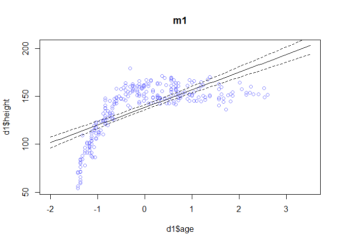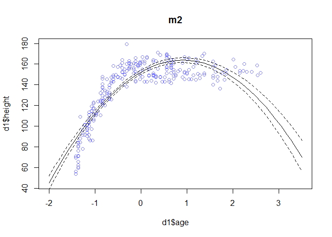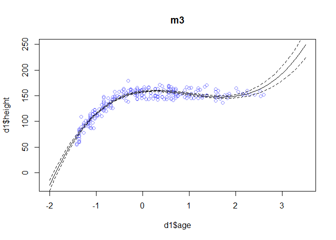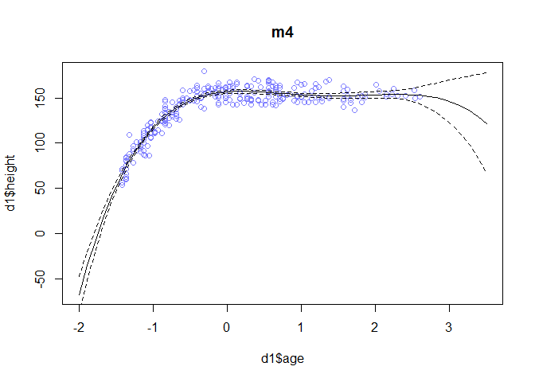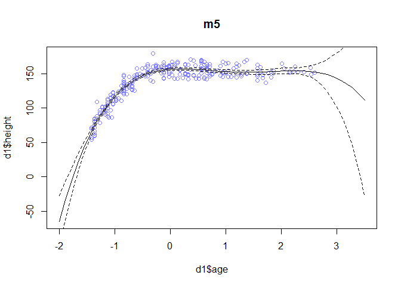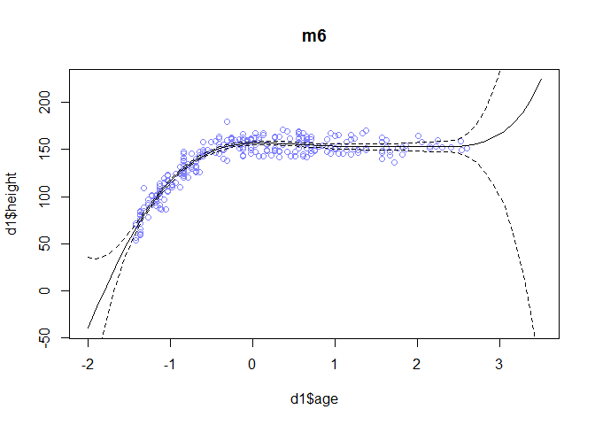

```r
#example of assign and get ... use fewer lines of code!
a <- 1
my.object.name <- "a"
my.object.name
get(my.object.name)
assign(my.object.name, "cat")


#m1
pred.6h2.m1 <- link( m1 , data=d.predict )
mu.m1 <- apply( pred.6h2.m1 , 2 , mean )
mu.PI.m1 <- apply( pred.6h2.m1 , 2, function(x) PI(x, prob=0.97) )
# plot it all
plot( height ~ age , d1 , col=rangi2 )
#dashed regression line
lines( ag.seq , mu.m1 , lty=2 )
shade(mu.PI.m1, ag.seq)
```

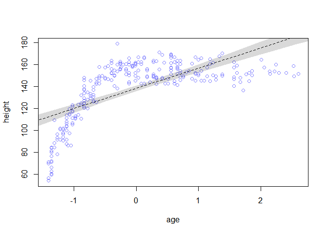

```r
#m2
pred.6h2.m2 <- link( m2 , data=d.predict )
mu.m2 <- apply( pred.6h2.m2 , 2 , mean )
mu.PI.m2 <- apply( pred.6h2.m2 , 2, function(x) PI(x, prob=0.97) )
plot( height ~ age , d1 , col=rangi2 )
lines( ag.seq , mu.m2 , lty=2 )
shade(mu.PI.m2, ag.seq)
```

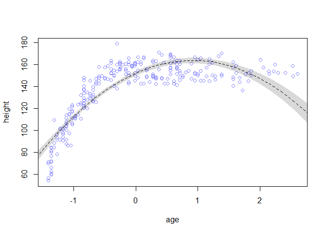

```r
#m3
pred.6h2.m3 <- link( m3 , data=d.predict )
mu.m3 <- apply( pred.6h2.m3 , 2 , mean )
mu.PI.m3 <- apply( pred.6h2.m3 , 2, function(x) PI(x, prob=0.97) )
plot( height ~ age , d1 , col=rangi2 )
lines( ag.seq , mu.m3 , lty=2 )
shade(mu.PI.m3, ag.seq)
```

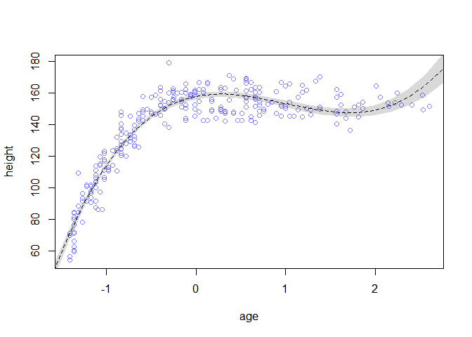

```r
#m4
pred.6h2.m4 <- link( m4 , data=d.predict )
mu.m4 <- apply( pred.6h2.m4 , 2 , mean )
mu.PI.m4 <- apply( pred.6h2.m4 , 2, function(x) PI(x, prob=0.97) )
plot( height ~ age , d1 , col=rangi2 )
lines( ag.seq , mu.m4 , lty=2 )
shade(mu.PI.m4, ag.seq)
```

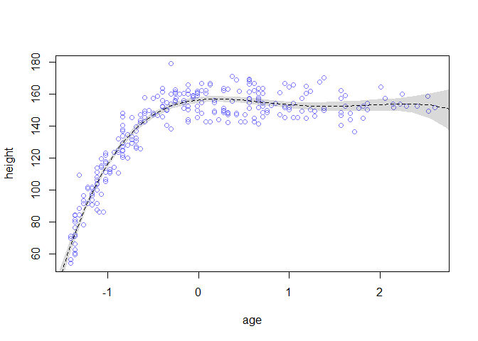

```r
#m5
pred.6h2.m5 <- link( m5 , data=d.predict )
mu.m5 <- apply( pred.6h2.m5 , 2 , mean )
mu.PI.m5 <- apply( pred.6h2.m5 , 2, function(x) PI(x, prob=0.97) )
plot( height ~ age , d1 , col=rangi2 )
lines( ag.seq , mu.m5 , lty=2 )
shade(mu.PI.m5, ag.seq)
```

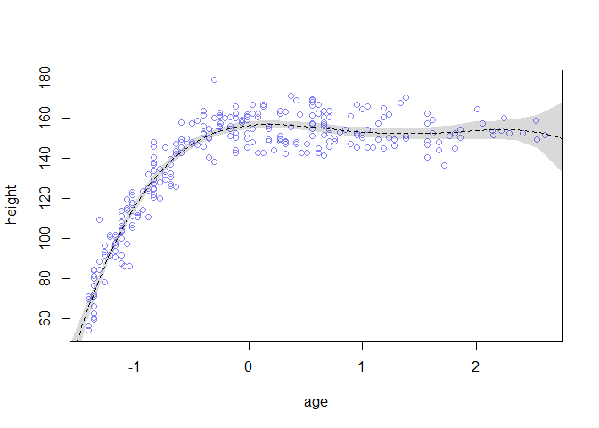

```r
#m6
pred.6h2.m6 <- link( m6 , data=d.predict )
mu.m6 <- apply( pred.6h2.m6 , 2 , mean )
mu.PI.m6 <- apply( pred.6h2.m6 , 2 , function(x) PI(x, prob=0.97) )
plot( height ~ age , d1 , col=rangi2 )
lines( ag.seq , mu.m6 , lty=2 )
shade(mu.PI.m6, ag.seq)
```

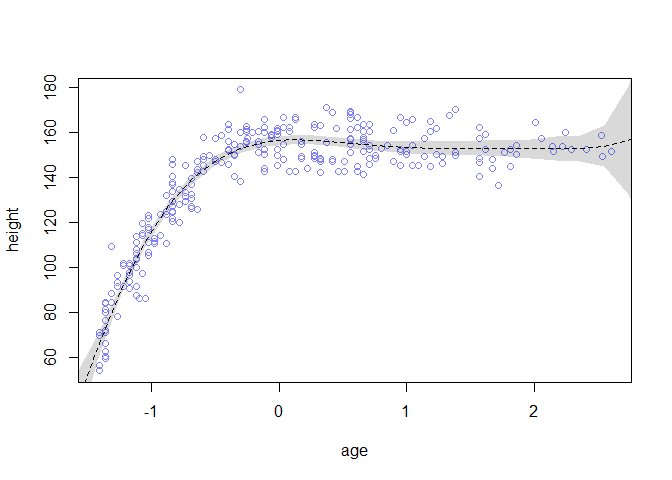

Model 1 and model 2 fit the data poorly; models 4 through 6 predict the data reasonably well. The PI is high over age 2.

##6H3

```r
d1.ensemble <- ensemble( m1 , m2 , m3 , m4 , m5, m6, data=d.predict )
```

```
## Constructing posterior predictions
## Constructing posterior predictions
## Constructing posterior predictions
## Constructing posterior predictions
## Constructing posterior predictions
## Constructing posterior predictions
```

```r
mu.6h3 <- apply( d1.ensemble$link , 2 , mean )
mu.PI.6h3 <- apply( d1.ensemble$link , 2 , PI )
plot( height ~ age , d1 , col=rangi2, xlim=c(-2,4))
lines( ag.seq , mu.6h3 )
shade( mu.PI.6h3 , ag.seq )
```

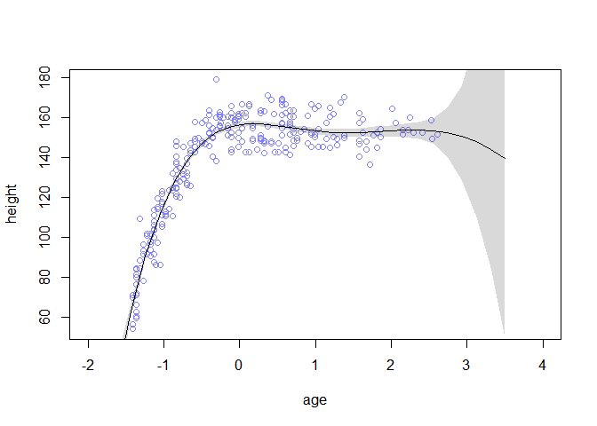
The averaged predictions have a narrower PI than the highest WAIC model, particularly in the data-sparse region with high ages. There's a little less "wiggle" to the prediction (inflection?).

##6H4
Compute the test-sample deviance for each model. This means calculating deviance, but using the data in d2 now. 


```r
#see R code 6.11 in the book for in-sample
#Julin's method: use a loop again
models <- ls(pattern="^m[1-6]$")
test.dev <- sapply(models, function(m){
  model <- get(m)
  input <- as.list(coef(model))
  input$age <- d2$age
  #str(m5)
  #equations as we wrote them are stored by MAP
  #last slot (@) is links
  #m5@links
  #m5@links[[1]]
  #m5@links[[1]][[2]]
  equation <- model@links[[1]][[2]]
  #parse: take out of character string into an equation
  #evaluate the equation == calculate with a, b1, age
  mu <- eval(parse(text=equation), envir = input)
  dev <- -2*sum(dnorm(d2$height, mu, input$sigma, log=T))
  dev
})
test.dev
```

```
##       m1       m2       m3       m4       m5       m6 
## 2422.308 2138.064 1932.347 1876.231 1876.585 1875.830
```

```r
#my method below
#m1
post.m1 <- extract.samples(m1,n=1000)

#log-likelihood of each observation i at each sample s from the posterior
n_samples <- 1000
loglik.m1 <- sapply( 1:n_samples ,
function(s) {
mu <- post.m1$a[s] + post.m1$b1[s]*d2$age
dnorm( d2$height , mu , post.m1$sigma[s] , log=TRUE )
} )

#compute Bayesian deviance lppd
n_cases <- nrow(d2) 
lppd.m1 <- sapply( 1:n_cases , function(i) log_sum_exp(loglik.m1[i,]) - log(n_samples) )

#m2
post.m2 <- extract.samples(m2,n=1000)
n_samples <- 1000
ll.m2 <- sapply( 1:n_samples ,
function(s) {
mu <- post.m2$a[s] + post.m2$b1[s]*d2$age + post.m2$b2[s]*(d2$age^2)
dnorm( d2$height , mu , post.m2$sigma[s] , log=TRUE )
} )
n_cases <- nrow(d2) 
lppd.m2 <- sapply( 1:n_cases , function(i) log_sum_exp(ll.m2[i,]) - log(n_samples))
                   
#m3
post.m3 <- extract.samples(m3,n=1000)
n_samples <- 1000
ll.m3 <- sapply( 1:n_samples ,
function(s) {
mu <- post.m3$a[s] + post.m3$b1[s]*d2$age + post.m3$b2[s]*(d2$age^2) + post.m3$b3[s]*(d2$age^3)
dnorm( d2$height , mu , post.m3$sigma[s] , log=TRUE )
} )
n_cases <- nrow(d2) 
lppd.m3 <- sapply( 1:n_cases , function(i) log_sum_exp(ll.m3[i,]) - log(n_samples))
                   
#m4
post.m4 <- extract.samples(m4,n=1000)
n_samples <- 1000
ll.m4 <- sapply( 1:n_samples ,
function(s) {
mu <- post.m4$a[s] + post.m4$b1[s]*d2$age + post.m4$b2[s]*(d2$age^2) + post.m4$b3[s]*(d2$age^3) + post.m4$b4[s]*(d2$age^4)
dnorm( d2$height , mu , post.m4$sigma[s] , log=TRUE )
} )
n_cases <- nrow(d2) 
lppd.m4 <- sapply( 1:n_cases , function(i) log_sum_exp(ll.m4[i,]) - log(n_samples))

#m5
post.m5 <- extract.samples(m5,n=1000)
n_samples <- 1000
ll.m5 <- sapply( 1:n_samples ,
function(s) {
mu <- post.m5$a[s] + post.m5$b1[s]*d2$age + post.m5$b2[s]*(d2$age^2) + post.m5$b3[s]*(d2$age^3) + post.m5$b4[s]*(d2$age^4) + post.m5$b5[s]*(d2$age^5)
dnorm( d2$height , mu , post.m5$sigma[s] , log=TRUE )
} )
n_cases <- nrow(d2) 
lppd.m5 <- sapply( 1:n_cases , function(i) log_sum_exp(ll.m5[i,]) - log(n_samples))

#m6
post.m6 <- extract.samples(m6,n=1000)
n_samples <- 1000
ll.m6 <- sapply( 1:n_samples ,
function(s) {
mu <- post.m6$a[s] + post.m6$b1[s]*d2$age + post.m6$b2[s]*(d2$age^2) + post.m6$b3[s]*(d2$age^3) + post.m6$b4[s]*(d2$age^4) + post.m6$b5[s]*(d2$age^5) + post.m6$b6[s]*(d2$age^6)
dnorm( d2$height , mu , post.m6$sigma[s] , log=TRUE )
} )
n_cases <- nrow(d2) 
lppd.m6 <- sapply( 1:n_cases , function(i) log_sum_exp(ll.m6[i,]) - log(n_samples))

sum(lppd.m1)                   
```

```
## [1] -1210.769
```

```r
sum(lppd.m2)
```

```
## [1] -1068.142
```

```r
sum(lppd.m3)
```

```
## [1] -964.0675
```

```r
sum(lppd.m4)
```

```
## [1] -938.7431
```

```r
sum(lppd.m5)
```

```
## [1] -939.1857
```

```r
sum(lppd.m6)
```

```
## [1] -938.4131
```

#6H5

```r
Dev.m1 <- sum(lppd.m1) - sum(lppd.m6)
Dev.m2 <- sum(lppd.m2) - sum(lppd.m6)
Dev.m3 <- sum(lppd.m3) - sum(lppd.m6)
Dev.m4 <- sum(lppd.m4) - sum(lppd.m6)
Dev.m5 <- sum(lppd.m5) - sum(lppd.m6)
Dev.m6 <- sum(lppd.m6) - sum(lppd.m6)

WAIC.m1 <- 2395.4 - 1926.1
WAIC.m2 <- 2150.2 - 1926.1
WAIC.m3 <- 1952.7 - 1926.1
WAIC.m4 <- 1926.1 - 1926.1
WAIC.m5 <- 1927.5 - 1926.1
WAIC.m6 <- 1927.7 - 1926.1

Dev.m1; Dev.m2; Dev.m3; Dev.m4; Dev.m5; Dev.m6
```

```
## [1] -272.3557
```

```
## [1] -129.7285
```

```
## [1] -25.6544
```

```
## [1] -0.3300621
```

```
## [1] -0.7726045
```

```
## [1] 0
```

```r
WAIC.m1; WAIC.m2; WAIC.m3; WAIC.m4; WAIC.m5; WAIC.m6
```

```
## [1] 469.3
```

```
## [1] 224.1
```

```
## [1] 26.6
```

```
## [1] 0
```

```
## [1] 1.4
```

```
## [1] 1.6
```
Model 6 makes the best out-of-sample predictions. WAIC is failry accurate, but true test deviance is a bit higher.

## 6H6

```r
m6h6 <- map(
  alist(
   height ~ dnorm( mu , sigma ) ,
    mu <- a + b1*age + b2*(age^2) + b3*(age^3) + b4*(age^4) + b5*(age^5) + b6*(age^6),
  c(b1,b2,b3,b4,b5,b6) ~ dnorm( 0 , 5 ) ,
  sigma ~ dunif( 0 , 50 ),
  a ~ dnorm( mean(height) , 50 )),
  data=d1 )

#plot predictions
ag.seq <- seq(from=-2,to=3,length.out=30)
d.predict <- list(
  height = rep(0,30), # empty outcome
  age = ag.seq
)
pred.m6h6 <- link(m6h6, data=d.predict)
```

```
## [ 100 / 1000 ]
[ 200 / 1000 ]
[ 300 / 1000 ]
[ 400 / 1000 ]
[ 500 / 1000 ]
[ 600 / 1000 ]
[ 700 / 1000 ]
[ 800 / 1000 ]
[ 900 / 1000 ]
[ 1000 / 1000 ]
```

```r
mu.m6h6 <- apply(pred.m6h6, 2, mean)
mu.PI.m6h6 <- apply(pred.m6h6, 2, function(x) PI(x, prob=0.97))
plot(height~age, d1, col=rangi2, xlim=c(-2,3))
lines(ag.seq, mu.m6h6, lty=2)
shade(mu.PI.m6h6, ag.seq)
```

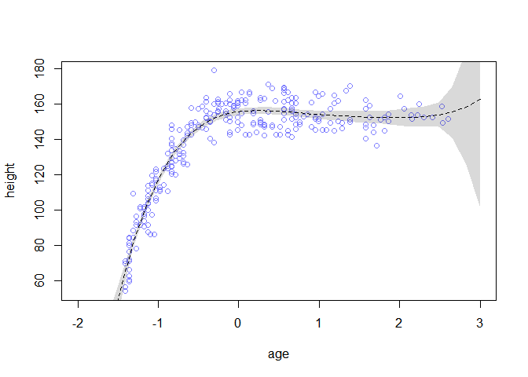

```r
#model 7 does better outside of range than model 6 did: shrinks priors for p5 & p6

#compute out-of-sample deviance
post.m6h6 <- extract.samples(m6h6,n=1000)
n_samples <- 1000
ll.m6h6 <- sapply( 1:n_samples ,
function(s) {
mu <- post.m6h6$a[s] + post.m6h6$b1[s]*d2$age + post.m6h6$b2[s]*(d2$age^2) + post.m6h6$b3[s]*(d2$age^3) + post.m6h6$b4[s]*(d2$age^4) + post.m6h6$b5[s]*(d2$age^5) + post.m6h6$b6[s]*(d2$age^6)
dnorm( d2$height , mu , post.m6h6$sigma[s] , log=TRUE )
} )
n_cases <- nrow(d2) 
lppd.m6h6 <- sapply( 1:n_cases , function(i) log_sum_exp(ll.m6h6[i,]) - log(n_samples))

sum(lppd.m6h6)  
```

```
## [1] -938.4658
```

slightly better than best WAIC from earlier.
Regularizing priors: can do at least as well as model 4 (previously the best model)
Could try: computing deviance
