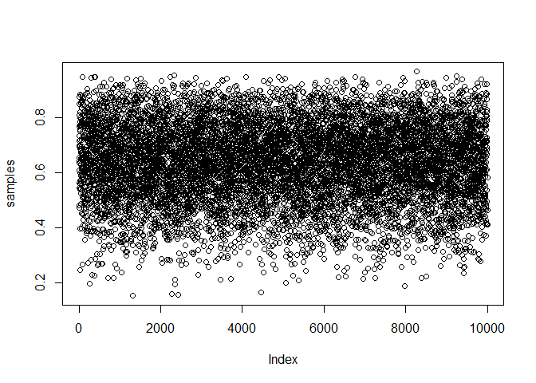

# Chapter3notes
Nicole E Soltis  
February 19, 2016  
##Example 3.1

```r
PrPV <- 0.95
PrPM <- 0.01
PrV <- 0.001
PrP <- PrPV*PrV + PrPM*(1-PrV)
( PrVP <- PrPV*PrV / PrP )
```

```
## [1] 0.08683729
```
## 3.2

```r
p_grid <- seq( from=0 , to=1 , length.out=1000 )
prior <- rep( 1 , 1000 )
likelihood <- dbinom( 6 , size=9 , prob=p_grid )
posterior <- likelihood * prior
posterior <- posterior / sum(posterior)
```
## 3.3 random sampling with replacement from the vector p_grid

```r
samples <- sample( p_grid , prob=posterior , size=1e4 , replace=TRUE )
```
if not including prob=posterior, will sample randomly

## 3.4

```r
plot(samples)
```



## 3.5

```r
library(rethinking)
```

```
## Loading required package: rstan
```

```
## Loading required package: ggplot2
```

```
## rstan (Version 2.9.0-3, packaged: 2016-02-11 15:54:41 UTC, GitRev: 05c3d0058b6a)
```

```
## For execution on a local, multicore CPU with excess RAM we recommend calling
## rstan_options(auto_write = TRUE)
## options(mc.cores = parallel::detectCores())
```

```
## Loading required package: parallel
```

```
## rethinking (Version 1.58)
```

```r
dens(samples)
```


## 3.6
add up posterior probability where p < 0.5 

```r
sum( posterior[ p_grid < 0.5 ] )
```

```
## [1] 0.1718746
```

## 3.7

```r
sum( samples < 0.5 ) / 1e4
```

```
## [1] 0.1665
```

## 3.8

```r
sum( samples > 0.5 & samples < 0.75 ) / 1e4
```

```
## [1] 0.6141
```

## 3.9

```r
quantile( samples , 0.8 )
```

```
##       80% 
## 0.7597598
```
80% of the data is below this cutoff

## 3.10

```r
quantile( samples , c( 0.1 , 0.9 ) )
```

```
##       10%       90% 
## 0.4494494 0.8118118
```

## 3.11

```r
p_grid <- seq( from=0 , to=1 , length.out=1000 )
prior <- rep(1,1000)
likelihood <- dbinom( 3 , size=3 , prob=p_grid )
posterior <- likelihood * prior
posterior <- posterior / sum(posterior)
samples <- sample( p_grid , size=1e4 , replace=TRUE , prob=posterior )
```

## 3.12

```r
PI( samples , prob=0.5 )
```

```
##       25%       75% 
## 0.7064565 0.9309309
```
percentile interval

## 3.13

```r
HPDI( samples , prob=0.5 )
```

```
##      |0.5      0.5| 
## 0.8408408 1.0000000
```
highest posterior density interval

narrowest interval

if data is normal or perfectly symmetrical, HPDI is equal to PI

more different if data is skewed

## 3.14

```r
p_grid[ which.max(posterior) ]
```

```
## [1] 1
```

## 3.15

```r
chainmode( samples , adj=0.01 )
```

```
## [1] 0.9857175
```

## 3.16

```r
mean( samples )
```

```
## [1] 0.7994526
```

```r
median( samples )
```

```
## [1] 0.8408408
```

## 3.17

```r
sum( posterior*abs( 0.5 - p_grid ) )
```

```
## [1] 0.3128752
```

##3.18

```r
#d is set to one value of p_grid vector at a time
#and for each value of d, calculates a new vector of difference between d and ALL of p_grid
#figuring out loss for EVERY POSSIBLE decision, d
loss <- sapply( p_grid , function(d) sum( posterior*abs( d - p_grid ) ) )
plot(p_grid,loss)
```


```r
which.min(loss)
```

```
## [1] 841
```

```r
p_grid[which.min(loss)]
```

```
## [1] 0.8408408
```

sapply: take each item in (vector or list), apply function to it

similar to pulling a function down a column in excel

```r
square_a_number <- function(x) x*x
sapply(p_grid, square_a_number)
```

```
##    [1] 0.000000e+00 1.002003e-06 4.008012e-06 9.018027e-06 1.603205e-05
##    [6] 2.505008e-05 3.607211e-05 4.909815e-05 6.412819e-05 8.116224e-05
##   [11] 1.002003e-04 1.212424e-04 1.442884e-04 1.693385e-04 1.963926e-04
##   [16] 2.254507e-04 2.565128e-04 2.895789e-04 3.246490e-04 3.617231e-04
##   [21] 4.008012e-04 4.418833e-04 4.849695e-04 5.300596e-04 5.771537e-04
##   [26] 6.262519e-04 6.773540e-04 7.304602e-04 7.855704e-04 8.426845e-04
##   [31] 9.018027e-04 9.629249e-04 1.026051e-03 1.091181e-03 1.158315e-03
##   [36] 1.227454e-03 1.298596e-03 1.371742e-03 1.446892e-03 1.524047e-03
##   [41] 1.603205e-03 1.684367e-03 1.767533e-03 1.852704e-03 1.939878e-03
##   [46] 2.029056e-03 2.120238e-03 2.213425e-03 2.308615e-03 2.405809e-03
##   [51] 2.505008e-03 2.606210e-03 2.709416e-03 2.814626e-03 2.921841e-03
##   [56] 3.031059e-03 3.142281e-03 3.255508e-03 3.370738e-03 3.487972e-03
##   [61] 3.607211e-03 3.728453e-03 3.851700e-03 3.976950e-03 4.104204e-03
##   [66] 4.233463e-03 4.364725e-03 4.497991e-03 4.633262e-03 4.770536e-03
##   [71] 4.909815e-03 5.051097e-03 5.194384e-03 5.339674e-03 5.486968e-03
##   [76] 5.636267e-03 5.787569e-03 5.940876e-03 6.096186e-03 6.253501e-03
##   [81] 6.412819e-03 6.574142e-03 6.737468e-03 6.902799e-03 7.070133e-03
##   [86] 7.239472e-03 7.410814e-03 7.584161e-03 7.759511e-03 7.936866e-03
##   [91] 8.116224e-03 8.297587e-03 8.480953e-03 8.666324e-03 8.853699e-03
##   [96] 9.043077e-03 9.234460e-03 9.427846e-03 9.623237e-03 9.820631e-03
##  [101] 1.002003e-02 1.022143e-02 1.042484e-02 1.063025e-02 1.083766e-02
##  [106] 1.104708e-02 1.125851e-02 1.147193e-02 1.168736e-02 1.190480e-02
##  [111] 1.212424e-02 1.234568e-02 1.256913e-02 1.279458e-02 1.302203e-02
##  [116] 1.325149e-02 1.348295e-02 1.371642e-02 1.395189e-02 1.418936e-02
##  [121] 1.442884e-02 1.467033e-02 1.491381e-02 1.515930e-02 1.540680e-02
##  [126] 1.565630e-02 1.590780e-02 1.616131e-02 1.641682e-02 1.667433e-02
##  [131] 1.693385e-02 1.719537e-02 1.745890e-02 1.772443e-02 1.799197e-02
##  [136] 1.826150e-02 1.853305e-02 1.880659e-02 1.908215e-02 1.935970e-02
##  [141] 1.963926e-02 1.992082e-02 2.020439e-02 2.048996e-02 2.077753e-02
##  [146] 2.106711e-02 2.135870e-02 2.165228e-02 2.194787e-02 2.224547e-02
##  [151] 2.254507e-02 2.284667e-02 2.315028e-02 2.345589e-02 2.376350e-02
##  [156] 2.407312e-02 2.438475e-02 2.469837e-02 2.501400e-02 2.533164e-02
##  [161] 2.565128e-02 2.597292e-02 2.629657e-02 2.662222e-02 2.694987e-02
##  [166] 2.727953e-02 2.761119e-02 2.794486e-02 2.828053e-02 2.861821e-02
##  [171] 2.895789e-02 2.929957e-02 2.964326e-02 2.998895e-02 3.033664e-02
##  [176] 3.068634e-02 3.103805e-02 3.139175e-02 3.174746e-02 3.210518e-02
##  [181] 3.246490e-02 3.282662e-02 3.319035e-02 3.355608e-02 3.392381e-02
##  [186] 3.429355e-02 3.466530e-02 3.503904e-02 3.541479e-02 3.579255e-02
##  [191] 3.617231e-02 3.655407e-02 3.693784e-02 3.732361e-02 3.771139e-02
##  [196] 3.810116e-02 3.849295e-02 3.888673e-02 3.928253e-02 3.968032e-02
##  [201] 4.008012e-02 4.048192e-02 4.088573e-02 4.129154e-02 4.169936e-02
##  [206] 4.210918e-02 4.252100e-02 4.293483e-02 4.335066e-02 4.376849e-02
##  [211] 4.418833e-02 4.461018e-02 4.503402e-02 4.545987e-02 4.588773e-02
##  [216] 4.631759e-02 4.674945e-02 4.718332e-02 4.761919e-02 4.805707e-02
##  [221] 4.849695e-02 4.893883e-02 4.938272e-02 4.982861e-02 5.027650e-02
##  [226] 5.072640e-02 5.117831e-02 5.163221e-02 5.208812e-02 5.254604e-02
##  [231] 5.300596e-02 5.346788e-02 5.393181e-02 5.439774e-02 5.486568e-02
##  [236] 5.533562e-02 5.580756e-02 5.628151e-02 5.675746e-02 5.723541e-02
##  [241] 5.771537e-02 5.819734e-02 5.868130e-02 5.916728e-02 5.965525e-02
##  [246] 6.014523e-02 6.063721e-02 6.113120e-02 6.162719e-02 6.212519e-02
##  [251] 6.262519e-02 6.312719e-02 6.363120e-02 6.413721e-02 6.464523e-02
##  [256] 6.515525e-02 6.566727e-02 6.618130e-02 6.669733e-02 6.721536e-02
##  [261] 6.773540e-02 6.825745e-02 6.878149e-02 6.930755e-02 6.983560e-02
##  [266] 7.036566e-02 7.089772e-02 7.143179e-02 7.196786e-02 7.250594e-02
##  [271] 7.304602e-02 7.358810e-02 7.413219e-02 7.467828e-02 7.522638e-02
##  [276] 7.577648e-02 7.632858e-02 7.688269e-02 7.743880e-02 7.799692e-02
##  [281] 7.855704e-02 7.911916e-02 7.968329e-02 8.024942e-02 8.081755e-02
##  [286] 8.138769e-02 8.195984e-02 8.253399e-02 8.311014e-02 8.368829e-02
##  [291] 8.426845e-02 8.485062e-02 8.543478e-02 8.602096e-02 8.660913e-02
##  [296] 8.719931e-02 8.779150e-02 8.838568e-02 8.898187e-02 8.958007e-02
##  [301] 9.018027e-02 9.078247e-02 9.138668e-02 9.199289e-02 9.260111e-02
##  [306] 9.321133e-02 9.382355e-02 9.443778e-02 9.505401e-02 9.567225e-02
##  [311] 9.629249e-02 9.691473e-02 9.753898e-02 9.816523e-02 9.879349e-02
##  [316] 9.942375e-02 1.000560e-01 1.006903e-01 1.013266e-01 1.019648e-01
##  [321] 1.026051e-01 1.032474e-01 1.038917e-01 1.045380e-01 1.051863e-01
##  [326] 1.058366e-01 1.064889e-01 1.071432e-01 1.077995e-01 1.084578e-01
##  [331] 1.091181e-01 1.097805e-01 1.104448e-01 1.111111e-01 1.117794e-01
##  [336] 1.124498e-01 1.131221e-01 1.137965e-01 1.144728e-01 1.151512e-01
##  [341] 1.158315e-01 1.165139e-01 1.171983e-01 1.178847e-01 1.185730e-01
##  [346] 1.192634e-01 1.199558e-01 1.206502e-01 1.213466e-01 1.220450e-01
##  [351] 1.227454e-01 1.234478e-01 1.241522e-01 1.248586e-01 1.255670e-01
##  [356] 1.262774e-01 1.269899e-01 1.277043e-01 1.284207e-01 1.291391e-01
##  [361] 1.298596e-01 1.305820e-01 1.313065e-01 1.320329e-01 1.327614e-01
##  [366] 1.334919e-01 1.342243e-01 1.349588e-01 1.356953e-01 1.364337e-01
##  [371] 1.371742e-01 1.379167e-01 1.386612e-01 1.394077e-01 1.401562e-01
##  [376] 1.409067e-01 1.416592e-01 1.424137e-01 1.431702e-01 1.439287e-01
##  [381] 1.446892e-01 1.454518e-01 1.462163e-01 1.469828e-01 1.477514e-01
##  [386] 1.485219e-01 1.492944e-01 1.500690e-01 1.508455e-01 1.516241e-01
##  [391] 1.524047e-01 1.531872e-01 1.539718e-01 1.547584e-01 1.555469e-01
##  [396] 1.563375e-01 1.571301e-01 1.579247e-01 1.587213e-01 1.595199e-01
##  [401] 1.603205e-01 1.611231e-01 1.619277e-01 1.627343e-01 1.635429e-01
##  [406] 1.643535e-01 1.651662e-01 1.659808e-01 1.667974e-01 1.676161e-01
##  [411] 1.684367e-01 1.692593e-01 1.700840e-01 1.709107e-01 1.717393e-01
##  [416] 1.725700e-01 1.734026e-01 1.742373e-01 1.750740e-01 1.759126e-01
##  [421] 1.767533e-01 1.775960e-01 1.784407e-01 1.792874e-01 1.801361e-01
##  [426] 1.809868e-01 1.818395e-01 1.826942e-01 1.835509e-01 1.844096e-01
##  [431] 1.852704e-01 1.861331e-01 1.869978e-01 1.878645e-01 1.887333e-01
##  [436] 1.896040e-01 1.904768e-01 1.913515e-01 1.922283e-01 1.931070e-01
##  [441] 1.939878e-01 1.948705e-01 1.957553e-01 1.966421e-01 1.975309e-01
##  [446] 1.984216e-01 1.993144e-01 2.002092e-01 2.011060e-01 2.020048e-01
##  [451] 2.029056e-01 2.038084e-01 2.047132e-01 2.056200e-01 2.065289e-01
##  [456] 2.074397e-01 2.083525e-01 2.092673e-01 2.101842e-01 2.111030e-01
##  [461] 2.120238e-01 2.129467e-01 2.138715e-01 2.147984e-01 2.157272e-01
##  [466] 2.166581e-01 2.175910e-01 2.185258e-01 2.194627e-01 2.204016e-01
##  [471] 2.213425e-01 2.222853e-01 2.232302e-01 2.241771e-01 2.251260e-01
##  [476] 2.260769e-01 2.270298e-01 2.279847e-01 2.289417e-01 2.299006e-01
##  [481] 2.308615e-01 2.318244e-01 2.327893e-01 2.337563e-01 2.347252e-01
##  [486] 2.356962e-01 2.366691e-01 2.376441e-01 2.386210e-01 2.396000e-01
##  [491] 2.405809e-01 2.415639e-01 2.425489e-01 2.435358e-01 2.445248e-01
##  [496] 2.455158e-01 2.465088e-01 2.475038e-01 2.485008e-01 2.494998e-01
##  [501] 2.505008e-01 2.515038e-01 2.525088e-01 2.535158e-01 2.545248e-01
##  [506] 2.555358e-01 2.565488e-01 2.575639e-01 2.585809e-01 2.595999e-01
##  [511] 2.606210e-01 2.616440e-01 2.626691e-01 2.636961e-01 2.647252e-01
##  [516] 2.657562e-01 2.667893e-01 2.678244e-01 2.688615e-01 2.699005e-01
##  [521] 2.709416e-01 2.719847e-01 2.730298e-01 2.740769e-01 2.751260e-01
##  [526] 2.761771e-01 2.772302e-01 2.782853e-01 2.793424e-01 2.804015e-01
##  [531] 2.814626e-01 2.825258e-01 2.835909e-01 2.846580e-01 2.857272e-01
##  [536] 2.867983e-01 2.878715e-01 2.889466e-01 2.900238e-01 2.911029e-01
##  [541] 2.921841e-01 2.932672e-01 2.943524e-01 2.954396e-01 2.965288e-01
##  [546] 2.976199e-01 2.987131e-01 2.998083e-01 3.009055e-01 3.020047e-01
##  [551] 3.031059e-01 3.042091e-01 3.053143e-01 3.064215e-01 3.075308e-01
##  [556] 3.086420e-01 3.097552e-01 3.108704e-01 3.119877e-01 3.131069e-01
##  [561] 3.142281e-01 3.153514e-01 3.164766e-01 3.176039e-01 3.187331e-01
##  [566] 3.198644e-01 3.209977e-01 3.221329e-01 3.232702e-01 3.244095e-01
##  [571] 3.255508e-01 3.266941e-01 3.278394e-01 3.289866e-01 3.301359e-01
##  [576] 3.312872e-01 3.324405e-01 3.335959e-01 3.347532e-01 3.359125e-01
##  [581] 3.370738e-01 3.382371e-01 3.394025e-01 3.405698e-01 3.417391e-01
##  [586] 3.429105e-01 3.440838e-01 3.452592e-01 3.464365e-01 3.476159e-01
##  [591] 3.487972e-01 3.499806e-01 3.511660e-01 3.523534e-01 3.535427e-01
##  [596] 3.547341e-01 3.559275e-01 3.571229e-01 3.583203e-01 3.595197e-01
##  [601] 3.607211e-01 3.619245e-01 3.631299e-01 3.643373e-01 3.655467e-01
##  [606] 3.667581e-01 3.679716e-01 3.691870e-01 3.704044e-01 3.716239e-01
##  [611] 3.728453e-01 3.740688e-01 3.752942e-01 3.765217e-01 3.777511e-01
##  [616] 3.789826e-01 3.802161e-01 3.814515e-01 3.826890e-01 3.839285e-01
##  [621] 3.851700e-01 3.864134e-01 3.876589e-01 3.889064e-01 3.901559e-01
##  [626] 3.914074e-01 3.926609e-01 3.939164e-01 3.951740e-01 3.964335e-01
##  [631] 3.976950e-01 3.989585e-01 4.002240e-01 4.014916e-01 4.027611e-01
##  [636] 4.040327e-01 4.053062e-01 4.065818e-01 4.078593e-01 4.091389e-01
##  [641] 4.104204e-01 4.117040e-01 4.129896e-01 4.142771e-01 4.155667e-01
##  [646] 4.168583e-01 4.181519e-01 4.194475e-01 4.207451e-01 4.220447e-01
##  [651] 4.233463e-01 4.246499e-01 4.259555e-01 4.272631e-01 4.285727e-01
##  [656] 4.298843e-01 4.311980e-01 4.325136e-01 4.338312e-01 4.351509e-01
##  [661] 4.364725e-01 4.377962e-01 4.391218e-01 4.404495e-01 4.417791e-01
##  [666] 4.431108e-01 4.444444e-01 4.457801e-01 4.471178e-01 4.484575e-01
##  [671] 4.497991e-01 4.511428e-01 4.524885e-01 4.538362e-01 4.551859e-01
##  [676] 4.565376e-01 4.578913e-01 4.592470e-01 4.606047e-01 4.619645e-01
##  [681] 4.633262e-01 4.646899e-01 4.660556e-01 4.674234e-01 4.687931e-01
##  [686] 4.701649e-01 4.715386e-01 4.729144e-01 4.742921e-01 4.756719e-01
##  [691] 4.770536e-01 4.784374e-01 4.798232e-01 4.812109e-01 4.826007e-01
##  [696] 4.839925e-01 4.853863e-01 4.867821e-01 4.881799e-01 4.895797e-01
##  [701] 4.909815e-01 4.923853e-01 4.937911e-01 4.951989e-01 4.966087e-01
##  [706] 4.980205e-01 4.994344e-01 5.008502e-01 5.022680e-01 5.036879e-01
##  [711] 5.051097e-01 5.065336e-01 5.079594e-01 5.093873e-01 5.108171e-01
##  [716] 5.122490e-01 5.136829e-01 5.151187e-01 5.165566e-01 5.179965e-01
##  [721] 5.194384e-01 5.208822e-01 5.223281e-01 5.237760e-01 5.252259e-01
##  [726] 5.266778e-01 5.281317e-01 5.295876e-01 5.310456e-01 5.325055e-01
##  [731] 5.339674e-01 5.354313e-01 5.368973e-01 5.383652e-01 5.398351e-01
##  [736] 5.413071e-01 5.427810e-01 5.442570e-01 5.457349e-01 5.472149e-01
##  [741] 5.486968e-01 5.501808e-01 5.516668e-01 5.531548e-01 5.546447e-01
##  [746] 5.561367e-01 5.576307e-01 5.591267e-01 5.606247e-01 5.621247e-01
##  [751] 5.636267e-01 5.651307e-01 5.666367e-01 5.681447e-01 5.696547e-01
##  [756] 5.711668e-01 5.726808e-01 5.741968e-01 5.757149e-01 5.772349e-01
##  [761] 5.787569e-01 5.802810e-01 5.818070e-01 5.833351e-01 5.848651e-01
##  [766] 5.863972e-01 5.879313e-01 5.894673e-01 5.910054e-01 5.925455e-01
##  [771] 5.940876e-01 5.956317e-01 5.971778e-01 5.987259e-01 6.002760e-01
##  [776] 6.018281e-01 6.033822e-01 6.049383e-01 6.064964e-01 6.080565e-01
##  [781] 6.096186e-01 6.111828e-01 6.127489e-01 6.143170e-01 6.158872e-01
##  [786] 6.174593e-01 6.190334e-01 6.206096e-01 6.221878e-01 6.237679e-01
##  [791] 6.253501e-01 6.269342e-01 6.285204e-01 6.301086e-01 6.316988e-01
##  [796] 6.332909e-01 6.348851e-01 6.364813e-01 6.380795e-01 6.396797e-01
##  [801] 6.412819e-01 6.428861e-01 6.444923e-01 6.461006e-01 6.477108e-01
##  [806] 6.493230e-01 6.509372e-01 6.525535e-01 6.541717e-01 6.557919e-01
##  [811] 6.574142e-01 6.590384e-01 6.606647e-01 6.622929e-01 6.639232e-01
##  [816] 6.655554e-01 6.671897e-01 6.688260e-01 6.704643e-01 6.721045e-01
##  [821] 6.737468e-01 6.753911e-01 6.770374e-01 6.786857e-01 6.803360e-01
##  [826] 6.819883e-01 6.836426e-01 6.852989e-01 6.869572e-01 6.886175e-01
##  [831] 6.902799e-01 6.919442e-01 6.936105e-01 6.952789e-01 6.969492e-01
##  [836] 6.986215e-01 7.002959e-01 7.019722e-01 7.036506e-01 7.053310e-01
##  [841] 7.070133e-01 7.086977e-01 7.103841e-01 7.120724e-01 7.137628e-01
##  [846] 7.154552e-01 7.171496e-01 7.188460e-01 7.205444e-01 7.222448e-01
##  [851] 7.239472e-01 7.256516e-01 7.273580e-01 7.290664e-01 7.307768e-01
##  [856] 7.324892e-01 7.342037e-01 7.359201e-01 7.376385e-01 7.393590e-01
##  [861] 7.410814e-01 7.428059e-01 7.445323e-01 7.462608e-01 7.479912e-01
##  [866] 7.497237e-01 7.514582e-01 7.531946e-01 7.549331e-01 7.566736e-01
##  [871] 7.584161e-01 7.601606e-01 7.619071e-01 7.636555e-01 7.654060e-01
##  [876] 7.671585e-01 7.689131e-01 7.706696e-01 7.724281e-01 7.741886e-01
##  [881] 7.759511e-01 7.777157e-01 7.794822e-01 7.812507e-01 7.830213e-01
##  [886] 7.847938e-01 7.865684e-01 7.883449e-01 7.901235e-01 7.919040e-01
##  [891] 7.936866e-01 7.954711e-01 7.972577e-01 7.990463e-01 8.008369e-01
##  [896] 8.026295e-01 8.044240e-01 8.062206e-01 8.080192e-01 8.098198e-01
##  [901] 8.116224e-01 8.134270e-01 8.152337e-01 8.170423e-01 8.188529e-01
##  [906] 8.206655e-01 8.224801e-01 8.242968e-01 8.261154e-01 8.279360e-01
##  [911] 8.297587e-01 8.315833e-01 8.334100e-01 8.352386e-01 8.370693e-01
##  [916] 8.389020e-01 8.407366e-01 8.425733e-01 8.444120e-01 8.462527e-01
##  [921] 8.480953e-01 8.499400e-01 8.517867e-01 8.536354e-01 8.554861e-01
##  [926] 8.573388e-01 8.591935e-01 8.610502e-01 8.629090e-01 8.647697e-01
##  [931] 8.666324e-01 8.684971e-01 8.703639e-01 8.722326e-01 8.741033e-01
##  [936] 8.759761e-01 8.778508e-01 8.797276e-01 8.816063e-01 8.834871e-01
##  [941] 8.853699e-01 8.872546e-01 8.891414e-01 8.910302e-01 8.929209e-01
##  [946] 8.948137e-01 8.967085e-01 8.986053e-01 9.005041e-01 9.024049e-01
##  [951] 9.043077e-01 9.062125e-01 9.081193e-01 9.100281e-01 9.119390e-01
##  [956] 9.138518e-01 9.157666e-01 9.176834e-01 9.196023e-01 9.215231e-01
##  [961] 9.234460e-01 9.253708e-01 9.272977e-01 9.292265e-01 9.311574e-01
##  [966] 9.330902e-01 9.350251e-01 9.369620e-01 9.389009e-01 9.408417e-01
##  [971] 9.427846e-01 9.447295e-01 9.466764e-01 9.486253e-01 9.505762e-01
##  [976] 9.525291e-01 9.544840e-01 9.564409e-01 9.583998e-01 9.603608e-01
##  [981] 9.623237e-01 9.642886e-01 9.662555e-01 9.682245e-01 9.701954e-01
##  [986] 9.721684e-01 9.741433e-01 9.761203e-01 9.780992e-01 9.800802e-01
##  [991] 9.820631e-01 9.840481e-01 9.860351e-01 9.880241e-01 9.900150e-01
##  [996] 9.920080e-01 9.940030e-01 9.960000e-01 9.979990e-01 1.000000e+00
```

```r
#quicker version
sapply(p_grid, function(x) x*x)
```

```
##    [1] 0.000000e+00 1.002003e-06 4.008012e-06 9.018027e-06 1.603205e-05
##    [6] 2.505008e-05 3.607211e-05 4.909815e-05 6.412819e-05 8.116224e-05
##   [11] 1.002003e-04 1.212424e-04 1.442884e-04 1.693385e-04 1.963926e-04
##   [16] 2.254507e-04 2.565128e-04 2.895789e-04 3.246490e-04 3.617231e-04
##   [21] 4.008012e-04 4.418833e-04 4.849695e-04 5.300596e-04 5.771537e-04
##   [26] 6.262519e-04 6.773540e-04 7.304602e-04 7.855704e-04 8.426845e-04
##   [31] 9.018027e-04 9.629249e-04 1.026051e-03 1.091181e-03 1.158315e-03
##   [36] 1.227454e-03 1.298596e-03 1.371742e-03 1.446892e-03 1.524047e-03
##   [41] 1.603205e-03 1.684367e-03 1.767533e-03 1.852704e-03 1.939878e-03
##   [46] 2.029056e-03 2.120238e-03 2.213425e-03 2.308615e-03 2.405809e-03
##   [51] 2.505008e-03 2.606210e-03 2.709416e-03 2.814626e-03 2.921841e-03
##   [56] 3.031059e-03 3.142281e-03 3.255508e-03 3.370738e-03 3.487972e-03
##   [61] 3.607211e-03 3.728453e-03 3.851700e-03 3.976950e-03 4.104204e-03
##   [66] 4.233463e-03 4.364725e-03 4.497991e-03 4.633262e-03 4.770536e-03
##   [71] 4.909815e-03 5.051097e-03 5.194384e-03 5.339674e-03 5.486968e-03
##   [76] 5.636267e-03 5.787569e-03 5.940876e-03 6.096186e-03 6.253501e-03
##   [81] 6.412819e-03 6.574142e-03 6.737468e-03 6.902799e-03 7.070133e-03
##   [86] 7.239472e-03 7.410814e-03 7.584161e-03 7.759511e-03 7.936866e-03
##   [91] 8.116224e-03 8.297587e-03 8.480953e-03 8.666324e-03 8.853699e-03
##   [96] 9.043077e-03 9.234460e-03 9.427846e-03 9.623237e-03 9.820631e-03
##  [101] 1.002003e-02 1.022143e-02 1.042484e-02 1.063025e-02 1.083766e-02
##  [106] 1.104708e-02 1.125851e-02 1.147193e-02 1.168736e-02 1.190480e-02
##  [111] 1.212424e-02 1.234568e-02 1.256913e-02 1.279458e-02 1.302203e-02
##  [116] 1.325149e-02 1.348295e-02 1.371642e-02 1.395189e-02 1.418936e-02
##  [121] 1.442884e-02 1.467033e-02 1.491381e-02 1.515930e-02 1.540680e-02
##  [126] 1.565630e-02 1.590780e-02 1.616131e-02 1.641682e-02 1.667433e-02
##  [131] 1.693385e-02 1.719537e-02 1.745890e-02 1.772443e-02 1.799197e-02
##  [136] 1.826150e-02 1.853305e-02 1.880659e-02 1.908215e-02 1.935970e-02
##  [141] 1.963926e-02 1.992082e-02 2.020439e-02 2.048996e-02 2.077753e-02
##  [146] 2.106711e-02 2.135870e-02 2.165228e-02 2.194787e-02 2.224547e-02
##  [151] 2.254507e-02 2.284667e-02 2.315028e-02 2.345589e-02 2.376350e-02
##  [156] 2.407312e-02 2.438475e-02 2.469837e-02 2.501400e-02 2.533164e-02
##  [161] 2.565128e-02 2.597292e-02 2.629657e-02 2.662222e-02 2.694987e-02
##  [166] 2.727953e-02 2.761119e-02 2.794486e-02 2.828053e-02 2.861821e-02
##  [171] 2.895789e-02 2.929957e-02 2.964326e-02 2.998895e-02 3.033664e-02
##  [176] 3.068634e-02 3.103805e-02 3.139175e-02 3.174746e-02 3.210518e-02
##  [181] 3.246490e-02 3.282662e-02 3.319035e-02 3.355608e-02 3.392381e-02
##  [186] 3.429355e-02 3.466530e-02 3.503904e-02 3.541479e-02 3.579255e-02
##  [191] 3.617231e-02 3.655407e-02 3.693784e-02 3.732361e-02 3.771139e-02
##  [196] 3.810116e-02 3.849295e-02 3.888673e-02 3.928253e-02 3.968032e-02
##  [201] 4.008012e-02 4.048192e-02 4.088573e-02 4.129154e-02 4.169936e-02
##  [206] 4.210918e-02 4.252100e-02 4.293483e-02 4.335066e-02 4.376849e-02
##  [211] 4.418833e-02 4.461018e-02 4.503402e-02 4.545987e-02 4.588773e-02
##  [216] 4.631759e-02 4.674945e-02 4.718332e-02 4.761919e-02 4.805707e-02
##  [221] 4.849695e-02 4.893883e-02 4.938272e-02 4.982861e-02 5.027650e-02
##  [226] 5.072640e-02 5.117831e-02 5.163221e-02 5.208812e-02 5.254604e-02
##  [231] 5.300596e-02 5.346788e-02 5.393181e-02 5.439774e-02 5.486568e-02
##  [236] 5.533562e-02 5.580756e-02 5.628151e-02 5.675746e-02 5.723541e-02
##  [241] 5.771537e-02 5.819734e-02 5.868130e-02 5.916728e-02 5.965525e-02
##  [246] 6.014523e-02 6.063721e-02 6.113120e-02 6.162719e-02 6.212519e-02
##  [251] 6.262519e-02 6.312719e-02 6.363120e-02 6.413721e-02 6.464523e-02
##  [256] 6.515525e-02 6.566727e-02 6.618130e-02 6.669733e-02 6.721536e-02
##  [261] 6.773540e-02 6.825745e-02 6.878149e-02 6.930755e-02 6.983560e-02
##  [266] 7.036566e-02 7.089772e-02 7.143179e-02 7.196786e-02 7.250594e-02
##  [271] 7.304602e-02 7.358810e-02 7.413219e-02 7.467828e-02 7.522638e-02
##  [276] 7.577648e-02 7.632858e-02 7.688269e-02 7.743880e-02 7.799692e-02
##  [281] 7.855704e-02 7.911916e-02 7.968329e-02 8.024942e-02 8.081755e-02
##  [286] 8.138769e-02 8.195984e-02 8.253399e-02 8.311014e-02 8.368829e-02
##  [291] 8.426845e-02 8.485062e-02 8.543478e-02 8.602096e-02 8.660913e-02
##  [296] 8.719931e-02 8.779150e-02 8.838568e-02 8.898187e-02 8.958007e-02
##  [301] 9.018027e-02 9.078247e-02 9.138668e-02 9.199289e-02 9.260111e-02
##  [306] 9.321133e-02 9.382355e-02 9.443778e-02 9.505401e-02 9.567225e-02
##  [311] 9.629249e-02 9.691473e-02 9.753898e-02 9.816523e-02 9.879349e-02
##  [316] 9.942375e-02 1.000560e-01 1.006903e-01 1.013266e-01 1.019648e-01
##  [321] 1.026051e-01 1.032474e-01 1.038917e-01 1.045380e-01 1.051863e-01
##  [326] 1.058366e-01 1.064889e-01 1.071432e-01 1.077995e-01 1.084578e-01
##  [331] 1.091181e-01 1.097805e-01 1.104448e-01 1.111111e-01 1.117794e-01
##  [336] 1.124498e-01 1.131221e-01 1.137965e-01 1.144728e-01 1.151512e-01
##  [341] 1.158315e-01 1.165139e-01 1.171983e-01 1.178847e-01 1.185730e-01
##  [346] 1.192634e-01 1.199558e-01 1.206502e-01 1.213466e-01 1.220450e-01
##  [351] 1.227454e-01 1.234478e-01 1.241522e-01 1.248586e-01 1.255670e-01
##  [356] 1.262774e-01 1.269899e-01 1.277043e-01 1.284207e-01 1.291391e-01
##  [361] 1.298596e-01 1.305820e-01 1.313065e-01 1.320329e-01 1.327614e-01
##  [366] 1.334919e-01 1.342243e-01 1.349588e-01 1.356953e-01 1.364337e-01
##  [371] 1.371742e-01 1.379167e-01 1.386612e-01 1.394077e-01 1.401562e-01
##  [376] 1.409067e-01 1.416592e-01 1.424137e-01 1.431702e-01 1.439287e-01
##  [381] 1.446892e-01 1.454518e-01 1.462163e-01 1.469828e-01 1.477514e-01
##  [386] 1.485219e-01 1.492944e-01 1.500690e-01 1.508455e-01 1.516241e-01
##  [391] 1.524047e-01 1.531872e-01 1.539718e-01 1.547584e-01 1.555469e-01
##  [396] 1.563375e-01 1.571301e-01 1.579247e-01 1.587213e-01 1.595199e-01
##  [401] 1.603205e-01 1.611231e-01 1.619277e-01 1.627343e-01 1.635429e-01
##  [406] 1.643535e-01 1.651662e-01 1.659808e-01 1.667974e-01 1.676161e-01
##  [411] 1.684367e-01 1.692593e-01 1.700840e-01 1.709107e-01 1.717393e-01
##  [416] 1.725700e-01 1.734026e-01 1.742373e-01 1.750740e-01 1.759126e-01
##  [421] 1.767533e-01 1.775960e-01 1.784407e-01 1.792874e-01 1.801361e-01
##  [426] 1.809868e-01 1.818395e-01 1.826942e-01 1.835509e-01 1.844096e-01
##  [431] 1.852704e-01 1.861331e-01 1.869978e-01 1.878645e-01 1.887333e-01
##  [436] 1.896040e-01 1.904768e-01 1.913515e-01 1.922283e-01 1.931070e-01
##  [441] 1.939878e-01 1.948705e-01 1.957553e-01 1.966421e-01 1.975309e-01
##  [446] 1.984216e-01 1.993144e-01 2.002092e-01 2.011060e-01 2.020048e-01
##  [451] 2.029056e-01 2.038084e-01 2.047132e-01 2.056200e-01 2.065289e-01
##  [456] 2.074397e-01 2.083525e-01 2.092673e-01 2.101842e-01 2.111030e-01
##  [461] 2.120238e-01 2.129467e-01 2.138715e-01 2.147984e-01 2.157272e-01
##  [466] 2.166581e-01 2.175910e-01 2.185258e-01 2.194627e-01 2.204016e-01
##  [471] 2.213425e-01 2.222853e-01 2.232302e-01 2.241771e-01 2.251260e-01
##  [476] 2.260769e-01 2.270298e-01 2.279847e-01 2.289417e-01 2.299006e-01
##  [481] 2.308615e-01 2.318244e-01 2.327893e-01 2.337563e-01 2.347252e-01
##  [486] 2.356962e-01 2.366691e-01 2.376441e-01 2.386210e-01 2.396000e-01
##  [491] 2.405809e-01 2.415639e-01 2.425489e-01 2.435358e-01 2.445248e-01
##  [496] 2.455158e-01 2.465088e-01 2.475038e-01 2.485008e-01 2.494998e-01
##  [501] 2.505008e-01 2.515038e-01 2.525088e-01 2.535158e-01 2.545248e-01
##  [506] 2.555358e-01 2.565488e-01 2.575639e-01 2.585809e-01 2.595999e-01
##  [511] 2.606210e-01 2.616440e-01 2.626691e-01 2.636961e-01 2.647252e-01
##  [516] 2.657562e-01 2.667893e-01 2.678244e-01 2.688615e-01 2.699005e-01
##  [521] 2.709416e-01 2.719847e-01 2.730298e-01 2.740769e-01 2.751260e-01
##  [526] 2.761771e-01 2.772302e-01 2.782853e-01 2.793424e-01 2.804015e-01
##  [531] 2.814626e-01 2.825258e-01 2.835909e-01 2.846580e-01 2.857272e-01
##  [536] 2.867983e-01 2.878715e-01 2.889466e-01 2.900238e-01 2.911029e-01
##  [541] 2.921841e-01 2.932672e-01 2.943524e-01 2.954396e-01 2.965288e-01
##  [546] 2.976199e-01 2.987131e-01 2.998083e-01 3.009055e-01 3.020047e-01
##  [551] 3.031059e-01 3.042091e-01 3.053143e-01 3.064215e-01 3.075308e-01
##  [556] 3.086420e-01 3.097552e-01 3.108704e-01 3.119877e-01 3.131069e-01
##  [561] 3.142281e-01 3.153514e-01 3.164766e-01 3.176039e-01 3.187331e-01
##  [566] 3.198644e-01 3.209977e-01 3.221329e-01 3.232702e-01 3.244095e-01
##  [571] 3.255508e-01 3.266941e-01 3.278394e-01 3.289866e-01 3.301359e-01
##  [576] 3.312872e-01 3.324405e-01 3.335959e-01 3.347532e-01 3.359125e-01
##  [581] 3.370738e-01 3.382371e-01 3.394025e-01 3.405698e-01 3.417391e-01
##  [586] 3.429105e-01 3.440838e-01 3.452592e-01 3.464365e-01 3.476159e-01
##  [591] 3.487972e-01 3.499806e-01 3.511660e-01 3.523534e-01 3.535427e-01
##  [596] 3.547341e-01 3.559275e-01 3.571229e-01 3.583203e-01 3.595197e-01
##  [601] 3.607211e-01 3.619245e-01 3.631299e-01 3.643373e-01 3.655467e-01
##  [606] 3.667581e-01 3.679716e-01 3.691870e-01 3.704044e-01 3.716239e-01
##  [611] 3.728453e-01 3.740688e-01 3.752942e-01 3.765217e-01 3.777511e-01
##  [616] 3.789826e-01 3.802161e-01 3.814515e-01 3.826890e-01 3.839285e-01
##  [621] 3.851700e-01 3.864134e-01 3.876589e-01 3.889064e-01 3.901559e-01
##  [626] 3.914074e-01 3.926609e-01 3.939164e-01 3.951740e-01 3.964335e-01
##  [631] 3.976950e-01 3.989585e-01 4.002240e-01 4.014916e-01 4.027611e-01
##  [636] 4.040327e-01 4.053062e-01 4.065818e-01 4.078593e-01 4.091389e-01
##  [641] 4.104204e-01 4.117040e-01 4.129896e-01 4.142771e-01 4.155667e-01
##  [646] 4.168583e-01 4.181519e-01 4.194475e-01 4.207451e-01 4.220447e-01
##  [651] 4.233463e-01 4.246499e-01 4.259555e-01 4.272631e-01 4.285727e-01
##  [656] 4.298843e-01 4.311980e-01 4.325136e-01 4.338312e-01 4.351509e-01
##  [661] 4.364725e-01 4.377962e-01 4.391218e-01 4.404495e-01 4.417791e-01
##  [666] 4.431108e-01 4.444444e-01 4.457801e-01 4.471178e-01 4.484575e-01
##  [671] 4.497991e-01 4.511428e-01 4.524885e-01 4.538362e-01 4.551859e-01
##  [676] 4.565376e-01 4.578913e-01 4.592470e-01 4.606047e-01 4.619645e-01
##  [681] 4.633262e-01 4.646899e-01 4.660556e-01 4.674234e-01 4.687931e-01
##  [686] 4.701649e-01 4.715386e-01 4.729144e-01 4.742921e-01 4.756719e-01
##  [691] 4.770536e-01 4.784374e-01 4.798232e-01 4.812109e-01 4.826007e-01
##  [696] 4.839925e-01 4.853863e-01 4.867821e-01 4.881799e-01 4.895797e-01
##  [701] 4.909815e-01 4.923853e-01 4.937911e-01 4.951989e-01 4.966087e-01
##  [706] 4.980205e-01 4.994344e-01 5.008502e-01 5.022680e-01 5.036879e-01
##  [711] 5.051097e-01 5.065336e-01 5.079594e-01 5.093873e-01 5.108171e-01
##  [716] 5.122490e-01 5.136829e-01 5.151187e-01 5.165566e-01 5.179965e-01
##  [721] 5.194384e-01 5.208822e-01 5.223281e-01 5.237760e-01 5.252259e-01
##  [726] 5.266778e-01 5.281317e-01 5.295876e-01 5.310456e-01 5.325055e-01
##  [731] 5.339674e-01 5.354313e-01 5.368973e-01 5.383652e-01 5.398351e-01
##  [736] 5.413071e-01 5.427810e-01 5.442570e-01 5.457349e-01 5.472149e-01
##  [741] 5.486968e-01 5.501808e-01 5.516668e-01 5.531548e-01 5.546447e-01
##  [746] 5.561367e-01 5.576307e-01 5.591267e-01 5.606247e-01 5.621247e-01
##  [751] 5.636267e-01 5.651307e-01 5.666367e-01 5.681447e-01 5.696547e-01
##  [756] 5.711668e-01 5.726808e-01 5.741968e-01 5.757149e-01 5.772349e-01
##  [761] 5.787569e-01 5.802810e-01 5.818070e-01 5.833351e-01 5.848651e-01
##  [766] 5.863972e-01 5.879313e-01 5.894673e-01 5.910054e-01 5.925455e-01
##  [771] 5.940876e-01 5.956317e-01 5.971778e-01 5.987259e-01 6.002760e-01
##  [776] 6.018281e-01 6.033822e-01 6.049383e-01 6.064964e-01 6.080565e-01
##  [781] 6.096186e-01 6.111828e-01 6.127489e-01 6.143170e-01 6.158872e-01
##  [786] 6.174593e-01 6.190334e-01 6.206096e-01 6.221878e-01 6.237679e-01
##  [791] 6.253501e-01 6.269342e-01 6.285204e-01 6.301086e-01 6.316988e-01
##  [796] 6.332909e-01 6.348851e-01 6.364813e-01 6.380795e-01 6.396797e-01
##  [801] 6.412819e-01 6.428861e-01 6.444923e-01 6.461006e-01 6.477108e-01
##  [806] 6.493230e-01 6.509372e-01 6.525535e-01 6.541717e-01 6.557919e-01
##  [811] 6.574142e-01 6.590384e-01 6.606647e-01 6.622929e-01 6.639232e-01
##  [816] 6.655554e-01 6.671897e-01 6.688260e-01 6.704643e-01 6.721045e-01
##  [821] 6.737468e-01 6.753911e-01 6.770374e-01 6.786857e-01 6.803360e-01
##  [826] 6.819883e-01 6.836426e-01 6.852989e-01 6.869572e-01 6.886175e-01
##  [831] 6.902799e-01 6.919442e-01 6.936105e-01 6.952789e-01 6.969492e-01
##  [836] 6.986215e-01 7.002959e-01 7.019722e-01 7.036506e-01 7.053310e-01
##  [841] 7.070133e-01 7.086977e-01 7.103841e-01 7.120724e-01 7.137628e-01
##  [846] 7.154552e-01 7.171496e-01 7.188460e-01 7.205444e-01 7.222448e-01
##  [851] 7.239472e-01 7.256516e-01 7.273580e-01 7.290664e-01 7.307768e-01
##  [856] 7.324892e-01 7.342037e-01 7.359201e-01 7.376385e-01 7.393590e-01
##  [861] 7.410814e-01 7.428059e-01 7.445323e-01 7.462608e-01 7.479912e-01
##  [866] 7.497237e-01 7.514582e-01 7.531946e-01 7.549331e-01 7.566736e-01
##  [871] 7.584161e-01 7.601606e-01 7.619071e-01 7.636555e-01 7.654060e-01
##  [876] 7.671585e-01 7.689131e-01 7.706696e-01 7.724281e-01 7.741886e-01
##  [881] 7.759511e-01 7.777157e-01 7.794822e-01 7.812507e-01 7.830213e-01
##  [886] 7.847938e-01 7.865684e-01 7.883449e-01 7.901235e-01 7.919040e-01
##  [891] 7.936866e-01 7.954711e-01 7.972577e-01 7.990463e-01 8.008369e-01
##  [896] 8.026295e-01 8.044240e-01 8.062206e-01 8.080192e-01 8.098198e-01
##  [901] 8.116224e-01 8.134270e-01 8.152337e-01 8.170423e-01 8.188529e-01
##  [906] 8.206655e-01 8.224801e-01 8.242968e-01 8.261154e-01 8.279360e-01
##  [911] 8.297587e-01 8.315833e-01 8.334100e-01 8.352386e-01 8.370693e-01
##  [916] 8.389020e-01 8.407366e-01 8.425733e-01 8.444120e-01 8.462527e-01
##  [921] 8.480953e-01 8.499400e-01 8.517867e-01 8.536354e-01 8.554861e-01
##  [926] 8.573388e-01 8.591935e-01 8.610502e-01 8.629090e-01 8.647697e-01
##  [931] 8.666324e-01 8.684971e-01 8.703639e-01 8.722326e-01 8.741033e-01
##  [936] 8.759761e-01 8.778508e-01 8.797276e-01 8.816063e-01 8.834871e-01
##  [941] 8.853699e-01 8.872546e-01 8.891414e-01 8.910302e-01 8.929209e-01
##  [946] 8.948137e-01 8.967085e-01 8.986053e-01 9.005041e-01 9.024049e-01
##  [951] 9.043077e-01 9.062125e-01 9.081193e-01 9.100281e-01 9.119390e-01
##  [956] 9.138518e-01 9.157666e-01 9.176834e-01 9.196023e-01 9.215231e-01
##  [961] 9.234460e-01 9.253708e-01 9.272977e-01 9.292265e-01 9.311574e-01
##  [966] 9.330902e-01 9.350251e-01 9.369620e-01 9.389009e-01 9.408417e-01
##  [971] 9.427846e-01 9.447295e-01 9.466764e-01 9.486253e-01 9.505762e-01
##  [976] 9.525291e-01 9.544840e-01 9.564409e-01 9.583998e-01 9.603608e-01
##  [981] 9.623237e-01 9.642886e-01 9.662555e-01 9.682245e-01 9.701954e-01
##  [986] 9.721684e-01 9.741433e-01 9.761203e-01 9.780992e-01 9.800802e-01
##  [991] 9.820631e-01 9.840481e-01 9.860351e-01 9.880241e-01 9.900150e-01
##  [996] 9.920080e-01 9.940030e-01 9.960000e-01 9.979990e-01 1.000000e+00
```

##3.19

```r
p_grid[ which.min(loss) ]
```

```
## [1] 0.8408408
```

## 3.20

```r
dbinom( 0:2 , size=2 , prob=0.7 )
```

```
## [1] 0.09 0.42 0.49
```

## 3.21

Dummy data observation of seeing W in 2 tosses of globe

```r
rbinom( 1 , size=2 , prob=0.7 )
```

```
## [1] 1
```

## 3.22 

Run 10 simulations

```r
set.seed(100)
rbinom( 10 , size=2 , prob=0.7 )
```

```
##  [1] 2 2 1 2 2 2 1 2 1 2
```

## 3.23

In 100k observations, each value occurs in proportion to its likelihood

```r
dummy_w <- rbinom( 1e5 , size=2 , prob=0.7 )
table(dummy_w)/1e5
```

```
## dummy_w
##       0       1       2 
## 0.09016 0.41703 0.49281
```

## 3.24
now with a 9-toss sample size

```r
library(rethinking)
dummy_w <- rbinom( 1e5 , size=9 , prob=0.7 )
simplehist( dummy_w , xlab="dummy water count" )
```


## 3.25
simulate 10k predicted observations for 9 tosses

```r
w <- rbinom( 1e4 , size=9 , prob=0.6 )
library(rethinking)
simplehist(w)
```


next, propagate parameter uncertainty

replace prob with samples from the posterior

## 3.26

```r
#from 3.11
p_grid <- seq( from=0 , to=1 , length.out=1000 )
prior <- rep(1,1000)
likelihood <- dbinom( 3 , size=3 , prob=p_grid )
posterior <- likelihood * prior
posterior <- posterior / sum(posterior)
samples <- sample( p_grid , size=1e4 , replace=TRUE , prob=posterior )
w <- rbinom( 1e4 , size=9 , prob=samples )
library(rethinking)
simplehist(w)
```


## 3.28

```r
library(rethinking)
data(homeworkch3)

sum(birth1) + sum(birth2)
```

```
## [1] 111
```

## class notes
what's the point of all this?

observations

prior (some assumptions and/ or previous observations)

likelihood

posterior (distribution of parameter estimates)

sampling

describe distribution of a population

iteratively incorporate information from modeling to improve your estimation/ modeling

estimate structure of your population/ data set

incorporate previous knowledge

understand whether your model works

estimate certainty in your model/ estimation

1. develop a model that fits our data (to the extent possible)

2. use the model to estimate parameters (or principles)

3. make predictions and compare to other situations/ datasets. Describe data in ways that are not purely numeric.

